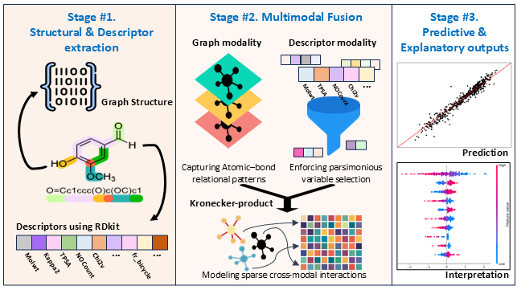

# KROVEX: Multimodal Graph Fusion with Statistically Guided Parsimonious Descriptor Selection for Molecular Property Prediction

<div align="center"></div>

## Environment installation
- This code was tested with Pytorch 2.1.0, cuda 12.1, torchvision 0.16.0
- Download ananconda/miniconda if needed
- Create an environment:

    `conda create -n krovex python=3.8`

- Activate conda

    `conda activate krovex`

- Install Pytorch:

    `pip install torch==2.1.0+cu121 torchvision==0.16.0+cu121 torchaudio==2.1.0+cu121 -f https://download.pytorch.org/whl/torch_stable.html`

- Install dgl library:

    `pip install dgl==2.2.1 -f https://data.dgl.ai/wheels/repo.html`

- Install packages using the requirement file:

    `pip install -r requirements.txt`

## Run the main code
- To run the main code: `python main.py`

- To run the code on only a few batches, epochs, and folds, you can change them in: `.\configs\config.yaml`

## Use KROVEX on a new dataset
- To implement a new dataset, you need to select descriptors through a `Descriptor Selection`. Check `\descriptor_selection` folder.

## Descriptor Selection
- To run the code `main_descriptor_selection.py`, you may need some preparation:

    - Install rpy2 libarary: `conda install -c conda-forge rpy2`

    - Download `R`

    - Check your version of R: `r --version`. The results should be the same version of R you downloaded.

    - Specifiy R path in `.\configs\config.yaml`

- Run the code for descriptor selection:

    `python .\descriptor_selection\main_descriptor_selection.py`

- To incoporate descriptors into the model, check `.\utils\mol_collate.py` and `.\utils\mol_conv.py` for details.

## Citation
- If you find our work helpful for your research, we would really appreciate it if you cite the following paper.
```
@article{jang2026multimodal,
  title={Multimodal graph fusion with statistically guided parsimonious descriptor selection for molecular property prediction},
  author={Jang, Yoonsuk and Lee, Juyeon and Jeong, Keunhong and Kim, Jaeoh},
  journal={Journal of Cheminformatics},
  year={2026},
  publisher={Springer}
}
```